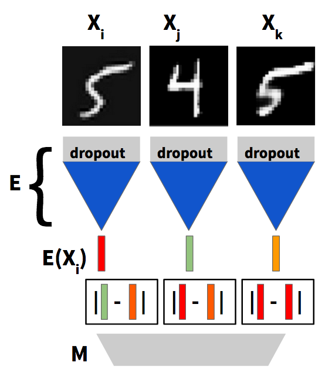

## Unsupervised and semi-supervised clustering with a siamese triplet: aka "the algorithm is always right"

The idea behind clustering with a siamese triplet is to have the algorithm examine three items and then pick the one item that doesn't fit with the other two.

